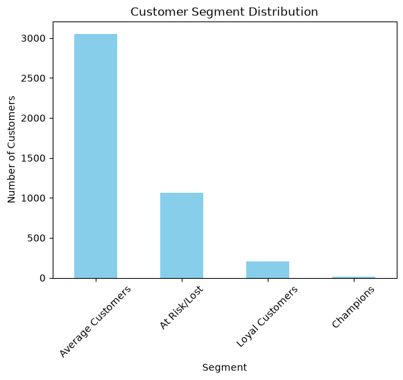
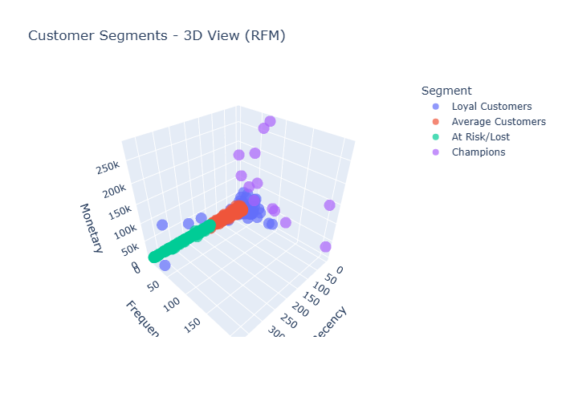

# Customer Segmentation using RFM Analysis

## Overview
This project analyzes customer purchase behavior using RFM (Recency, Frequency, Monetary) analysis combined with K-Means clustering to segment customers into actionable groups for targeted marketing strategies.

## Objective
To identify distinct customer segments based on transactional data, enabling data-driven marketing decisions such as retention campaigns, loyalty programs, and re-engagement strategies.

## Dataset
Online Retail Dataset — transactional data from a UK-based online retailer, containing invoice details, product descriptions, quantities, unit prices, and customer IDs.

## Tools & Technologies
- **Python** (Pandas, NumPy)
- **SQL** (SQLite) — for RFM metric extraction
- **Scikit-learn** — K-Means clustering, StandardScaler
- **Matplotlib, Plotly** — data visualization

## Methodology
1. **Data Cleaning** — Removed null customer IDs, cancelled orders, and invalid (negative/zero) transactions.
2. **Database Integration** — Loaded cleaned data into a SQLite database for structured querying.
3. **RFM Extraction** — Used SQL queries to calculate Recency, Frequency, and Monetary values per customer.
4. **Feature Scaling** — Standardized RFM features using StandardScaler for clustering compatibility.
5. **Clustering** — Applied K-Means clustering, with the optimal number of clusters determined via the Elbow Method.
6. **Segmentation** — Labeled clusters into business-relevant customer segments.
7. **Visualization** — Created distribution charts and an interactive 3D scatter plot to visualize segment characteristics.

## Key Findings

| Segment | Customer Count | Avg. Recency (days) | Avg. Frequency | Avg. Monetary |
|---|---|---|---|---|
| Champions | 13 | 7 | 82 | $127,338 |
| Loyal Customers | 204 | 15 | 22 | $12,709 |
| Average Customers | 3,054 | 44 | 4 | $1,359 |
| At Risk / Lost | 1,067 | 248 | 1.5 | $480 |

**Insights:**
- A small group of "Champions" (13 customers) generates disproportionately high revenue, warranting VIP retention strategies.
- 1,067 customers are at risk of churn, representing a key opportunity for re-engagement campaigns.
- The majority of customers fall into the "Average" segment, indicating potential for growth through targeted engagement.

## Visualizations

### Customer Segment Distribution

### 3D Cluster View (RFM)

## How to Run
1. Clone this repository
2. Install dependencies: `pip install pandas matplotlib seaborn scikit-learn plotly kaleido`
3. Open `rfm_analysis.ipynb` in Jupyter Notebook or VS Code
4. Run all cells sequentially

## Author
**Diya Lohana**  
[GitHub](https://github.com/Diya-Lohana) | [LinkedIn](https://linkedin.com/in/diya-lohana/)